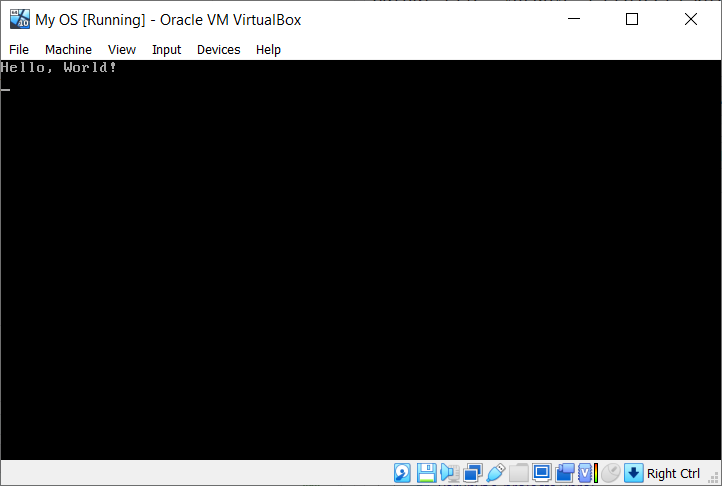

# Operating Systems  {#myOS}

myOS is a project which aims to build a small operating system, with the purpose of gaining a deeper understanding of how computers work. This article follows [nanobyte's video series](https://www.youtube.com/playlist?list=PLFjM7v6KGMpiH2G-kT781ByCNC_0pKpPN).

The operating system is to be written for the Intel (x86) architecture.

## Tools

We will need a couple of tools to put together our operating system:

- A text editor
- An assembler (we will use NASM)
- GNU Make
- qemu (or any other virtualisation software, e.g. VirtualBox)

We will use a Linux system to do our development. For Windows, the best option may be to use WSL (Windows Subsystem for Linux).

## Background Information
### How a computer starts up

The sequence is as follows:

- BIOS is copied from a ROM chip into RAM
- BIOS starts executing code
   - initialises hardware
   - runs some tests (POST = power on self test)
- BIOS searches for an OS to start
- BIOS loads and starts the OS
- OS runs

### How the BIOS finds an OS (2 ways):

LEGACY BOOTING

- BIOS loads first sector of each bootable device into memory (at location `0x7c00`)
- BIOS checks for `0xaa55` signature (last two bytes of the first sector)
- If found, it starts executing code

EFI

- BIOS looks for a special EFI partition which contains some special EFI programs
- OS must be compiled as an EFI program

We will use legacy booting for this OS.

### Memory Segmentation

The segment and offset addressing scheme for memory can be used. It has the form `segment:offset`. For example, a memory address could be represented as `0x1234:0x5678` where `0x1234` is the segment and `0x5678` is the offset.

In this scheme we address memory using two 16-bit values, the segment and the offset.

Each segment contains 64kb of memory, where each byte can be accessed using the offset value. Segments overlap every 16 bytes.

    real_address = segment * 16 + offset

This also means there are multiple ways to represent the same absolute memory address.

In x86 architecture, there are special registers used to specify the actively used segments.

    CS - currently running code segment
    DS - data segment
    SS - stack segment
    ES, FS, GS - extra (data) segments

In order to access data outside one of these active segments, we need to load that segment into one of these registers.

The code segment can only be modified by performing a jump.

Referencing a memory location:

    segment:[base + index * scale + displacement]

    segment:        CS, DS, ES, FS, GS, SS
                    if unspecified: SS when base register is BP
                    DS otherwise
    base:           (16 bits) BP/BX
                    (32/64 bits) any general purpose register
    index:          (16 bits) SI/DI
    scale:          (32/64 bits only) 1, 2, 4, 8
    displacement:   a (signed) constant value


Some limitations:

- Only BP and BX can be used as base registers
- Only SI and ID can be used as index registers
- Constants cannot be directly written to the segment registers. An intermediary register has to be used.

Most operating systems will switch to 32- or 64-bit mode
immediately after startup.[^modes]

### Bootloader and Kernel

The bootloader has some basic functions:

- loads basic components into memory
- put system in expected state
- collect information about system
- load the kernel.

We will write the bootloader in the first sector of the disk,
and the rest of the operating system (the kernel) will start
from the second sector onwards.

[^modes]: In order to preserve backwards compatibility with older programs made for 16-bit Intel CPUs, we start off in 16-bit mode. Afterwards, the switch is made from 16-bit mode to 32-bit or 64-bit mode.

## Writing the code

Now we can begin writing the code for our small operating system. At this stage, we have not much choice but to write our code in assembly language.[^language]

### Directives Used

These are some of the directives used:

`ORG` directive:
Tell the assembler where we expect our code to be loaded.
Assembler uses this information to calculate label addresses.

`BITS` directive:
Tell the assembler to emit 16/32/64-bit code.

`TIMES [number] [instruction/data]` directive:
Repeats given instruction/data a number of times.

`$`:  Memory offset of the current line.

`$$`: Memory offset of the beginning of the current section.

### Writing Assembly Code

We can now start to write assembly code in a file `main.asm`. We begin by writing some directives. A directive is a hint given to the assembler about how to process our code. It is not translated into any machine instructions.

For now, our tiny "operating system" will only print the string "Hello, World!". After this, we prevent code from being executed further.

As the CPU always starts in 16-bit mode, we use the `bits` directive to tell the assembler to emit 16-bit code.
```
org 0x7c00
bits 16
```

The end-of-line sequence consists of both the carriage return (`\r`) and line feed (`\n`). We define a symbol `ENDL` for convenience.
```
%define ENDL 0x0d, 0x0a
```

To print our string, we will implement a `puts` subroutine, similar to the `puts()` function from the C standard library.
```
start:
	jmp main


; 
; Prints a string to the screen.
; Params:
; 	- ds:si points to string, ASCII, zero-delimited.
; 
puts:
	; save registers we will modify
	push si
	push ax

.loop:
	lodsb		      ; loads next char into al
	or al, al	    ; check if the next char is null
	jz .done      ; jump if null

	mov ah, 0x0e  ; Print Character in TTY Mode
	mov bh, 0     ; Page Number
	int 0x10      ; BIOS Interrupt: Video
	jmp .loop
.done:
	pop ax
	pop si
	ret
```
After `puts` returns, the stack should be in the same state as before `puts` was called. This is why we save the values of `ax` and `si` before modifying them, and pop from the stack back into these registers at the end.

Now we write the code for `main` that we jump to from the `start` label.
We set up the data and stack segments, and call `puts`.
```
main:
	; setup data segments
	mov ax, 0	        ; can't write to ds/es directly
	mov ds, ax
	mov es, ax

	; setup stack
	mov ss, ax
	mov sp, 0x7c00    ; stack grows downwards from beginning of program

	; print message
	mov si, msg_hello
	call puts

	hlt               ; halt instruction

.freeze:
	jmp .freeze
```

The `msg_hello` label is defined as such:
```
msg_hello: db "Hello, World!", ENDL, 0
```

Now, we pad the program up to 512 bytes, including the special signature[^signature] that the BIOS will look for.

Here, `$-$$` calculates the length of the program so far in bytes.
```
times 510 - ($-$$) db 0   ; pad up to 510 bytes
dw 0AA55h                 ; define the two-byte signature
```

[^language]: Writing in assembly is time-consuming. We can later switch to a higher-level language, such as C.
[^signature]: The BIOS expects the last two bytes of the first sector to be `0xaa55`. On a standard 1.44Mb floppy disk, each sector is 512 bytes large. Thus, we pad the program up to 510 bytes and then declare the 2 bytes signature.

### Hello, World!

We can finally test our little operating system!
Assemble the code and pad it up to the length of a floppy disk (1440kb):
```
$ nasm main.asm -f bin -o build/main.bin
$ cp build/main.bin build/main_floppy.img
$ truncate -s 1440k build/main_floppy.img
```
You can use GNU make to run the above commands for you.

Testing our floppy disk in a virtual machine, we get the string printed out on the screen. I used VirtualBox for this demo.


