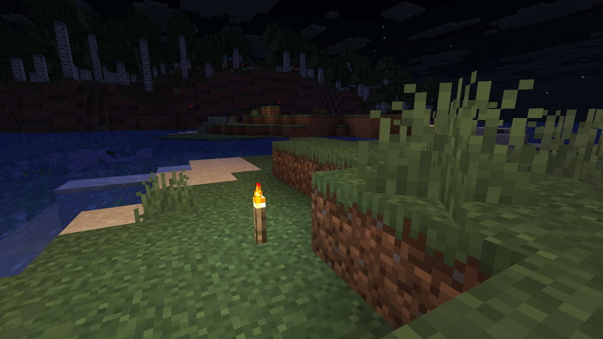
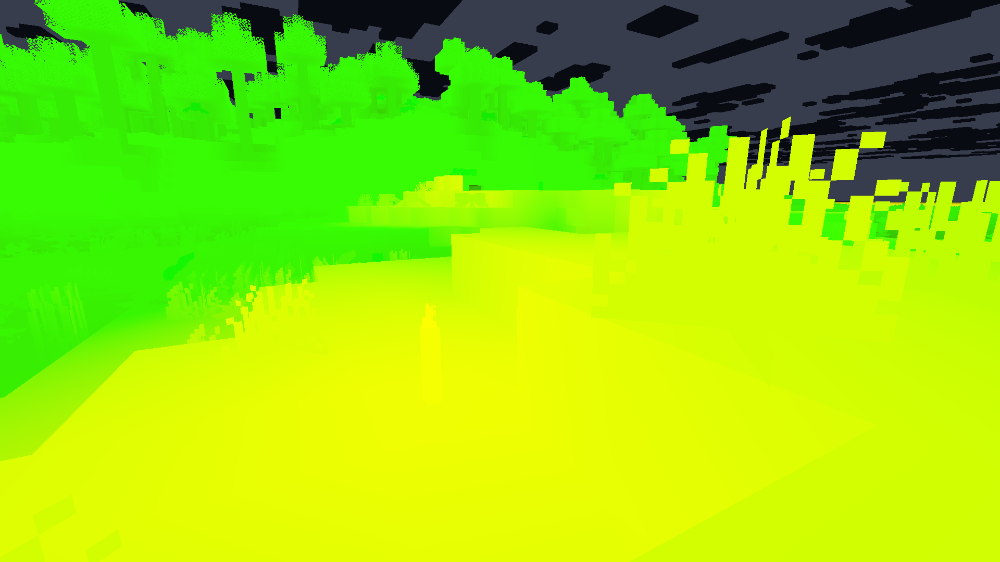
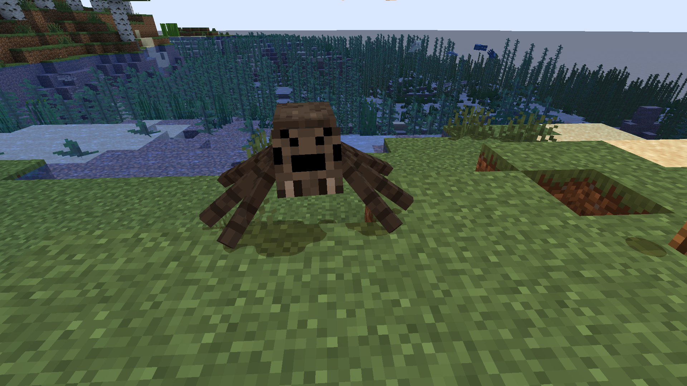
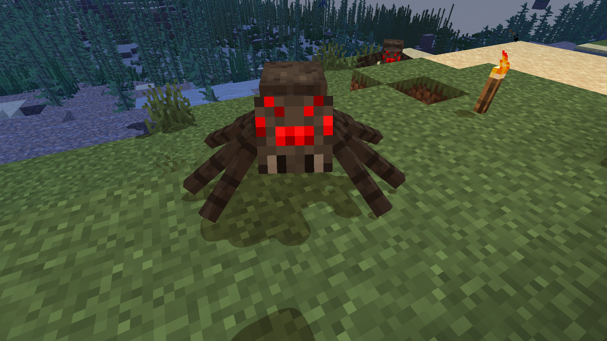
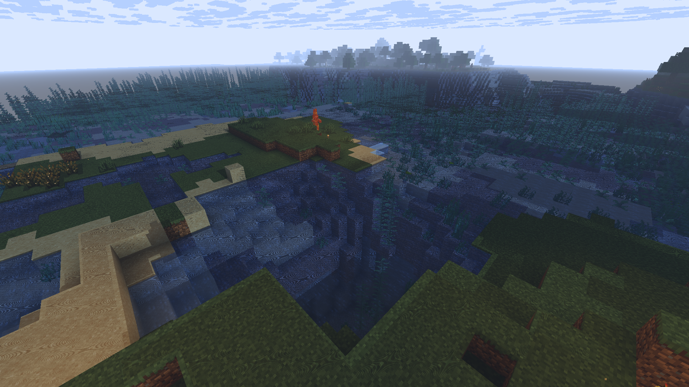
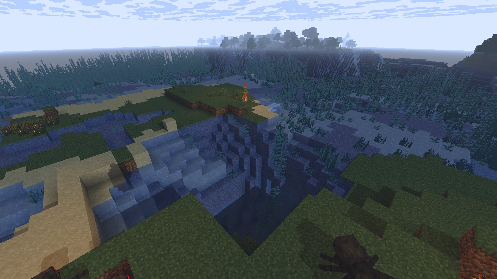
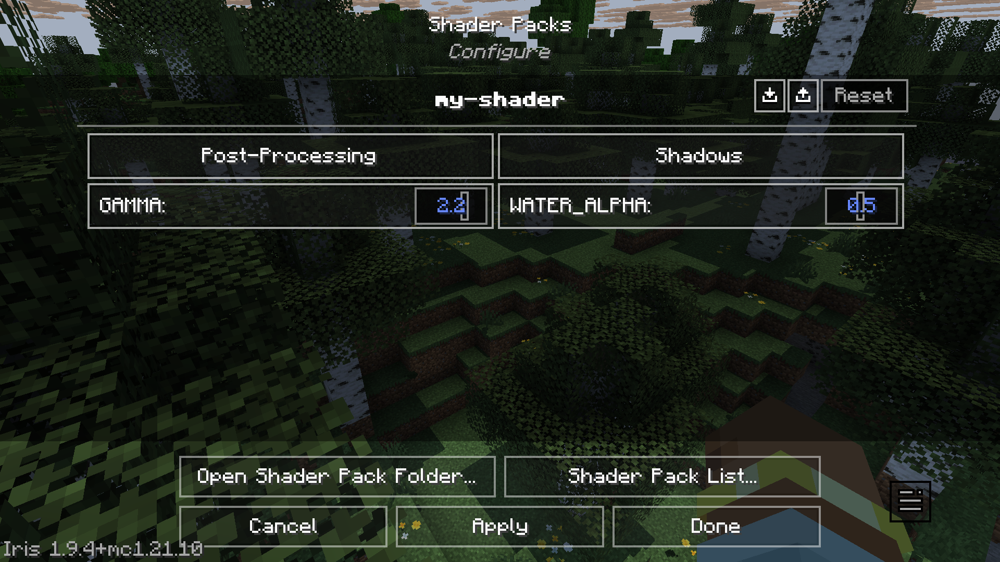
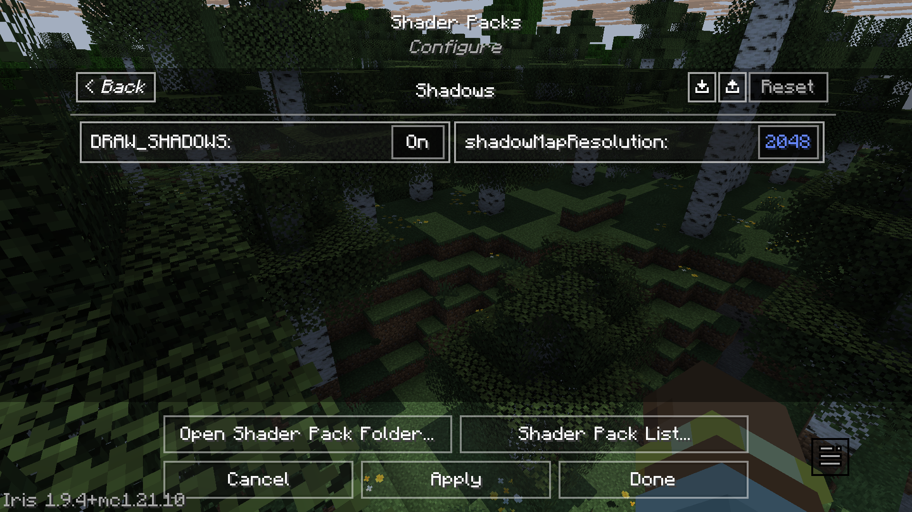
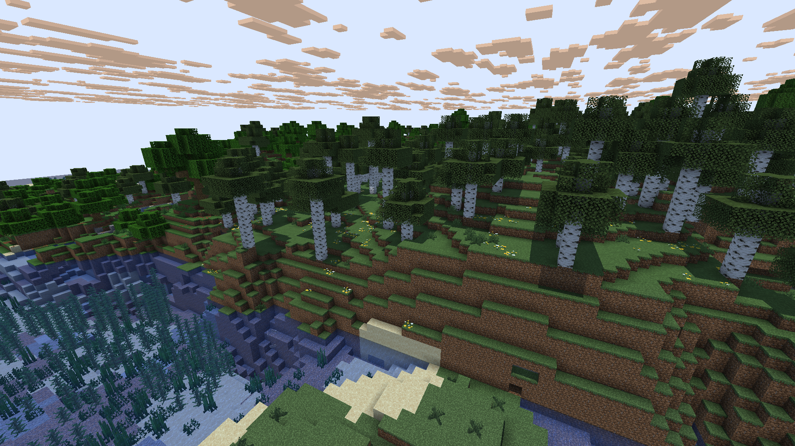
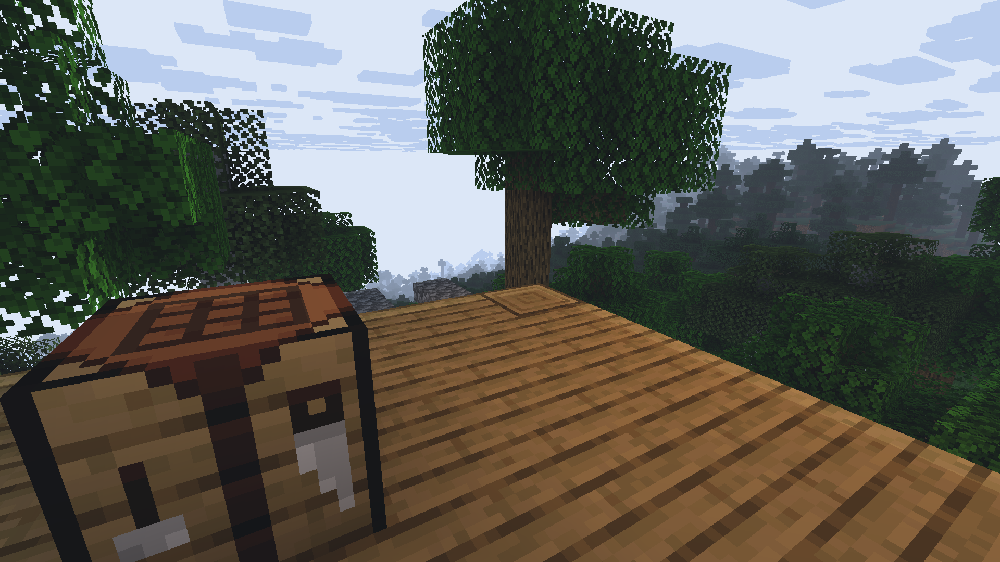

# My Experience Learning to Write Shaders
## The Spark

When I played Minecraft Pocket Edition (MCPE) years ago on my phone, my favourite shader was Entropy Shaders for Bedrock Edition (ESBE), written by McbeEringi. It not only greatly enhanced the visuals of the game, but also improved performance so that the game was much more playable on my phone.

Today, when I tried loading up this same shader from nearly 4 years ago, it didn't work. I then decided to look into how the shader itself was constructed - I unzipped the shaderpack to try and look into its files (`.mcpack` files are really just renamed `.zip` files) and figure out if something needed to be updated.

After some searching, I learnt that Bedrock Edition had replaced its rendering system entirely with a new system called RenderDragon, which meant that old shaders were no longer compatible. Without patching the executable, custom shaderpacks are not supported.

I still really wanted to somehow make ESBE work, or try to make a shader of my own. This made me want to learn how shaders actually work. While shaders on Bedrock Edition don't work natively anymore, installations like OptiFine and Iris on Java Edition can run shaderpacks written for them and there is a lot of control over the rendering pipeline. As such, I started my journey of writing shaders on Java by following the [official Iris Guide](https://shaders.properties/current/guides/your-first-shaderpack/0_intro/).

### Thinking in Parallel with GLSL

Minecraft shaders are usually written in OpenGL Shading Language (GLSL), which is very much like C but for the GPU. Each program has a main function `void main()`, and the syntax is also very close to C. You write a vertex shader and a fragment shader. The vertex shader is run on every vertex, while the fragment shader is run on every pixel.

Suppose we want to find the average of a color in order to implement a grayscale filter. We might naturally write something like this to add each component and then divide by 3:

```glsl
float grayscale = (color.r + color.g + color.b) / 3.0;
```

However, we can write it simpler the following way by using `dot` (vector dot product):

```glsl
float grayscale = dot(color, vec3(1.0 / 3.0));
```

This same concept of 'thinking in parallel' also applies when doing transformations from one space to another. Instead of 'manually' applying translation, scale, and rotation by accessing the position attribute directly, it's simpler and more flexible to use Model, View and Projection matrices to apply transformations using matrix multiplication. (This links back to our discussion on [coordinate spaces](#Coordinate%20Spaces) earlier.) Minecraft and most 3D graphics programs apply this same principle.

## Coordinate Spaces

It's a good idea to get the concept of coordinate spaces and transformations down before getting deep into shader code. The math involved is really applicable to all 3D graphics in general, not just Minecraft. There are a series of matrix transformations that are performed between these spaces, in order to draw three-dimensional vertices onto a two-dimensional screen.

Although I was already aware of these concepts, I had to briefly revisit them before I could continue learning. Minecraft uses the same usual coordinate spaces along with a few additional ones that are specific to the game. The most important coordinate spaces that we should be familiar with, in my opinion, are the Model, World, View, Clip, and Screen spaces.

Here's a summary I wrote of the core spaces and the transformations done between them:

| From Space  | To Space     | Transformation     | Explanation                                                              |
| ----------- | ------------ | ------------------ | ------------------------------------------------------------------------ |
| -           | Local Space  | -                  | The object's local coordinate system                                     |
| Local Space | World Space  | Model Matrix       | Place the object in the world                                            |
| World Space | View Space   | View Matrix        | Place the world from the camera's POV                                    |
| View Space  | Clip Space   | Projection Matrix  | Project 3D coordinates onto a 2D plane, and prepare for clipping         |
| Clip Space  | NDC Space    | Perspective Divide | Divide by the homogenous coordinate `w` to get vertices in $[-1.0, 1.0]$ |
| NDC Space   | Screen Space | Viewport Transform | Map NDC coords to screen coords, using the settings of `glViewport`      |

You can find more detail about these coordinate spaces and more on the [LearnOpenGL lesson](https://learnopengl.com/Getting-started/Coordinate-Systems), and the [Iris Shaders documentation page](https://shaders.properties/current/how-to/coordinate_spaces/).

## Deferred Shading

One thing that initially confused me was why lighting wasn’t calculated immediately in the geometry pass. It turns out Minecraft uses something called [deferred shading](https://learnopengl.com/Advanced-Lighting/Deferred-Shading). As scenes get more complex, doing geometry and lighting calculations in one pass can be wasteful as fragment shader output gets obscured by other objects that end up getting rendered on top.

Leaving lighting for a later stage makes lighting calculations faster by storing geometry information such as normals, depth, and color into a set of buffers. These buffers are called g-buffers, and are written to in the geometry pass (in the `gbuffers_*` programs). This information is then used in the lighting pass, such as in the `composite` fullscreen pass, to shade the scene.

## 'Visual Debugging': Numbers Are Colors

There isn't really a way to verify the actual numbers that are passing through our vertex and fragment shaders. We can't quite access a console to print debug statements like we normally would in a program written for the CPU.

Then how do we go about debugging our programs? We draw the values we suspect to be wrong directly to the screen. This is also how the Iris guide teaches us to interpret values given to us in Minecraft's lightmap. 

For reference, this is the original scene:



The lightmap has two components. We can associate the first component to the red channel and the second to the green channel. Then we draw it to the screen like so:

```glsl
color.rgb = vec3(lightmap, 0.0);
```

We should see something like this:


Yellow is formed from mixing red and green in computer graphics. So from the above image, we learn that blocklight is in the red channel (first component of lightmap), and skylight is in the green channel (second component of lightmap).

## Accidentally Breaking Some Entities

While messing around with the various `gbuffers_*` programs, I broke the appearance of spider and enderman eyes. They just appeared somewhat translucent or invisible:



I found that this was due to not overriding the `gbuffers_spidereyes` program. I had to add a 'default' `gbuffers_spidereyes.vsh` and `gbuffers_spidereyes.fsh` (the base shaders for most of the programs can be found on [GitHub](https://github.com/shaderLABS/Base-330)). After the fix, my spiders and endermen look much better.



## The Shadow Acne Problem

An interesting problem I encountered when rendering shadows is the shadow acne problem, which occurs when objects cast shadows onto themselves. This is due to the limited resolution of the shadow map. As you can see, there are strange alternating shadow patterns on the terrain.



To solve this, we must offset the object slightly in the direction of the light source (along the negative Z axis in shadow space). This offset is called the shadow bias, and it fixes most of the problem:

```glsl
const float SHADOW_BIAS = 0.001;
// ...
shadowClipPos.z -= SHADOW_BIAS;
```



You can read about this problem in detail on [LearnOpenGL](https://learnopengl.com/Advanced-Lighting/Shadows/Shadow-Mapping).

## Flexibility

After learning the core principles involved in just 'getting the code to work', I started looking into how to make the shader easy for people to actually use. More people will be able to enjoy using our shaders if we design them to be more flexible.

### Flexibility for Users

We can expose various rendering options to users to configure via the GUI. This allows users to control the ultimate look and feel of their game, and adapt the shader settings depending on the performance capabilities of their device.

These GUI options are defined through the `shaders.properties`file, which has a relatively simple format. The following short example defines a "Shadows" option menu which contains an option called `shadowMapResolution`.

```properties
screen = [Shadows]
screen.Shadows = shadowMapResolution
# More options...
```

On Iris, in Shader Pack Settings, the interface produced will look like this (I've added several other options too):



The option we defined is contained inside the "Shadows" menu:



### Flexibility for Multiple Platforms

If you want your shader to be able to run on many devices / platforms, you should be mindful about the availability of certain features, or stick to standard features. Iris itself has a goal of maintaining compatibility with OptiFine, although it offers more features. If you want your shader to also run on OptiFine, you should check for availability before using Iris-only features.

While looking through ESBE source (it's also on GitHub under MIT license), I found a detail about shader float precision. It turns out that support for high precision (`highp`) is not compulsory in the fragment shader, and only medium precision (`mediump`) might be available. The developer used a simple macro to switch accordingly:

```glsl
#ifdef GL_FRAGMENT_PRECISION_HIGH
        #define HM highp
#else
        #define HM mediump
#endif
```

The macro is used before a type to specify either a high precision or medium precision type, like this:

```glsl
HM vec3 rpos=reflect(wpos,n);
```

With this, the same source code can successfully compile on multiple devices, even if `highp` is not supported in the fragment shader.

## My Current Progress

So far, I’ve managed to get a small but working shader pipeline running. My shader currently has basic deferred lighting, simple shadows, and some small post-processing effects like custom fog and contrast adjustments. Along the way I encountered some funny rendering bugs, like entity eyes disappearing when I forgot to define the right program. I'm still learning, and my shader is far from perfect, but there's something fascinating about being able to execute my code from within Minecraft and see its effects in real time.





I’m still very early in this journey, and there’s a lot I want to explore next: soft shadows, better sky rendering, prettier water, and a better day/night cycle for lighting to name a few. Mostly, I’m trying to learn in small steps: modifying existing code, experimenting, and asking questions when something doesn’t behave as expected. Sometimes, I'll graph things out on [Desmos](https://www.desmos.com/calculator) to make sure an idea is mathematically sound before I implement it in code.

Before starting this project, I couldn't fathom how games like Minecraft were able to render such complex scenes to the screen. It felt like magic to me. Now, I'm glad that I understand even a tiny part of what’s happening under the hood.

## Resources

Thanks to the graphics community for their resources. Here are some resources that I found useful for learning:

- [3b1b's Linear Algebra Playlist](https://m.youtube.com/playlist?list=PLZHQObOWTQDPD3MizzM2xVFitgF8hE_ab)
- [The Cherno's OpenGL Playlist](https://youtube.com/playlist?list=PLlrATfBNZ98foTJPJ_Ev03o2oq3-GGOS2&si=ib0qWwjFgTjYI68-)
- [Iris Guide](https://shaders.properties/current/guides/your-first-shaderpack/0_intro/) and [Reference](https://shaders.properties/current/reference/overview/)
- [LearnOpenGL](https://learnopengl.com/)
- ShaderLABS Discord Server
- [ESBE source code](https://github.com/McbeEringi/esbe-3g/) (written by McbeEringi)
