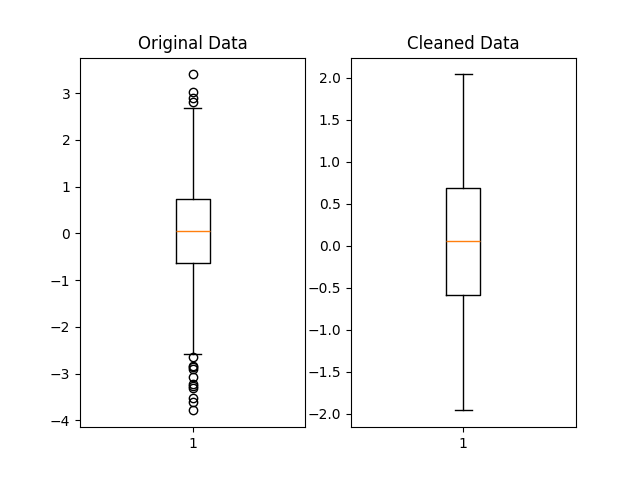

# Removing Outliers for Machine Learning


In this article, we will explain what outliers are and go over some outlier removal procedures, in the context of machine learning.

---

## What are outliers?

In statistics or machine learning, outliers in a dataset refer to data points that deviate significantly from the trend presented by the rest of the data points. When most of the other data points seem to fall in a similar general range or exhibit a similar pattern, outliers differ from this general trend.

Depending on the cause of the outliers and their prevalence in a dataset, it may be desirable to remove these extreme values before doing any further processing.

---

## Why should we remove outliers?

Removing outliers can be beneficial in many cases. If the chosen model is more sensitive to data distribution, then cleaning the data first would likely improve the model's accuracy. The k-nearest neighbors (KNN) algorithm will be more sensitive to outliers, for example, because it depends on the distance to the closest neighbors. Additionally, if the outliers are already known to be errors, or domain knowledge says the extreme values are practically impossible, their removal may be justified.

However, it is also important to consider whether the suspected outlier values are really erroneous in nature, and are safe to remove. Disproportionately sized values might indicate rare but important trends that, when removed from the dataset, cannot be picked up by the model. There is also a need for a clear and consistent definition of an outlier: there are several such standards which are applied in different cases.

---

## Deciding which values are outliers

We need to choose our definition of an outlier, and our method of outlier removal will mostly then be based on the standard we choose. As mentioned, there are several different ways of defining and identifying outliers. We will be working with the [pandas](https://pandas.pydata.org/) library in Python to go over a few of these methods below.

### Cutoff value

This is probably the simplest form of outlier removal, where all observations that are more extreme than a certain cutoff value will be considered outliers.

I will make use of the index operator[] for these functions as the syntax is concise. It operates on a DataFrame and selects certain rows from it. You can write a condition within the square brackets, which will determine the data that should be present in the selection. This is called [boolean indexing](https://pandas.pydata.org/docs/user_guide/indexing.html#boolean-indexing).

For instance, a statement like table[table[col] > 0.5] means: "Select all the records in column "col" in the DataFrame "table", where the value is more than 0.5".

Here we only select all the records that are larger than min_val and smaller than max_val, discarding the rest.

Possible implementation:

```python
import pandas as pd


def remove_cutoff(data: pd.DataFrame,
                  columns_to_clean: list,
                  min_val: float,
                  max_val: float) -> pd.DataFrame:
    result = data.copy()
    for col in result.columns:
        if col in columns_to_clean:
            result = result[result[col] >= min_val]
            result = result[result[col] <= max_val]
    return result
```

---

### Interquartile Range (IQR)

This method is related to box-and-whisker plots from statistics. The IQR is a measure of the spread of most of the data: larger IQR generally means the data points are distributed across a wider range.

The IQR statistic is related to the median. The median value is found by sorting the data points in increasing order, then selecting the data point in the middle position (or at the 50% mark of all the data). Similarly, the first quartile (Q1) and third quartile (Q3) are found from the 25% mark and 75% mark respectively. To be clear, the first quartile being at 25% means that it is the value **below which 25% of the data fall**.

Building upon the simple function we wrote above, we just have to calculate our upper and lower bounds, then use the same index operators to clean the data. I made use of the quantile method, which finds the data value at 25% (first quartile) and 75% (third quartile).

I also gave the threshold parameter a default value of 1.5. This is a typical value used for the endpoints of whiskers in a box-and-whisker plot (1.5 times the IQR).

Possible implementation:

```python
import pandas as pd


def remove_iqr(data: pd.DataFrame,
               columns_to_clean: list,
               threshold: float = 1.5) -> pd.DataFrame:
    result = data.copy()
    for col in result:
        if col in columns_to_clean:
            Q1 = result[col].quantile(0.25)
            Q3 = result[col].quantile(0.75)
            # Inter-quartile range (middle 50% range)
            IQR = Q3 - Q1
            min_val = Q1 - threshold * IQR
            max_val = Q3 + threshold * IQR
            result = result[result[col] >= min_val]
            result = result[result[col] <= max_val]
    return result
```

---

### Z-Score

The Z-Score, or standard score, refers to the number of standard deviations away from the mean that a data point lies at. In turn, standard deviation is a measure of the amount of variation a variable has about its mean.

Removing outliers based on Z-Score is a more consistent approach than the one described in the "cutoff method". That cutoff method depends on choosing a rather subjective cutoff value, which could be different for each feature. However, the Z-Score method does rely on the assumption that the features are normally distributed. Not all data can be considered normal or approximately normal, especially if the sample size is not large (see Central Limit Theorem).

Possible implementation:

```python
import pandas as pd


def remove_z_score(data: pd.DataFrame,
                   columns_to_clean: list,
                   n: float = 3) -> pd.DataFrame:
    result = data.copy()
    for col in result:
        if col in columns_to_clean:
            std = result[col].std()
            mean = result[col].mean()
            # Standardise the normal distribution
            min_val = -n * std + mean
            max_val = +n * std + mean
            result = result[result[col] >= min_val]
            result = result[result[col] <= max_val]
    return result
```

---

## Example

To illustrate the removal of outliers, let's generate some normally distributed random numbers and look at the result after cleaning:

```python
import pandas as pd
import numpy as np

original_data = np.random.standard_normal(size=2000)
original_data = pd.DataFrame(original_data)
```

Remove the data points that lie beyond 2 standard deviations away from the mean:

```python
cleaned_data = remove_z_score(original_data, original_data.columns, 2)
```

We can visually compare the distribution of the original and cleaned datasets using [matplotlib boxplots](https://matplotlib.org/stable/api/_as_gen/matplotlib.pyplot.boxplot.html):

```python
import matplotlib.pyplot as plt


fig, (ax1, ax2) = plt.subplots(1, 2)

ax1.set_title('Original Data')
ax1.boxplot(original_data)

ax2.set_title('Cleaned Data')
ax2.boxplot(cleaned_data)

plt.show()
```

Below is a possible graph that could be obtained. The outliers, marked by matplotlib as black circles beyond the whiskers, have been filtered out in the cleaned dataset.



---

## Conclusion

Cleaning outliers from your data properly, if you decide to do so, is a crucial part of data preprocessing and can lead to better predictions when done appropriately. You may want to run the analysis both with and without the suspected outliers, see how the model performs on each run, and then decide based on each model's performance. Accuracy could improve, but it might also stay relatively the same or even worsen.

The exact procedure you choose can depend on the nature of the dataset you have, taking into account factors such as data size and distribution. You could also build upon the methods shown here to develop your own outlier removal procedures.
